```{r setup, include=FALSE}
options(htmltools.dir.version = FALSE)
knitr::opts_chunk$set(
  fig.width=9, fig.height=3.5, fig.retina=3,
  fig.align = "center",
  out.width = "100%",
  cache = FALSE,
  echo = FALSE,
  message = FALSE, 
  warning = FALSE,
  hiline = TRUE
)
```


```{r metathis, echo=FALSE}
library(metathis)
meta() %>%
  meta_name("github-repo" = "beatrizmilz/2022-curso-de-verao-ime-usp-relatorios") %>% 
  meta_social(
    title = "Relatórios reprodutíveis com R",
    description = paste(
      "Apresentação do curso Relatórios reprodutíveis com R"
    ),
    url = "https://beatrizmilz.github.io/2022-curso-de-verao-ime-usp-relatorios/slides/",
    image = "https://beatrizmilz.github.io/2022-curso-de-verao-ime-usp-relatorios/slides/img/share-card.jpg",
    image_alt = paste(
      "Primeiro slide da apresentação do curso",
      "Relatórios reprodutíveis com R",
      "Ministrado por Beatriz Milz"
    ),
    og_type = "website",
    og_author = "Beatriz Milz",
    twitter_card_type = "summary_large_image",
    twitter_creator = "@beamilz"
  )
```


```{r xaringan-themer, include=FALSE, warning=FALSE}
library(xaringanthemer)
style_duo_accent(
  primary_color = "#1094AB",
  title_slide_background_color = "#ffffff",
  title_slide_text_color = "#1094AB",
  inverse_text_color = "#826b37",
  inverse_header_color = "#FDB525",
  inverse_background_color = "#f2f2f2",
  secondary_color = "#FDB525",
  background_color = "#FFFFFF",
  code_inline_background_color = "#faf0f4",
 
  
  header_font_google = google_font("Montserrat"),
  text_font_google   = google_font("Work Sans", "300", "300i"),
  code_font_google   = google_font("Roboto Mono"),
 base_font_size = "25px",
  extra_css = list(".remark-code-line" = list("background-color" = "#f2f2f2"))
)

```

```{r xaringanExtra-clipboard, echo=FALSE}
xaringanExtra::use_clipboard()
```


```{r, include=FALSE}
ref_pacotes_curso_r <- function(){
  cat('.topnote[<i class="far fa-flag"></i> [Slide](https://curso-r.github.io/main-pacotes/slides/index.html) adaptado do curso de [Pacotes](https://curso-r.com/cursos/pacotes/), da [Curso-R](https://curso-r.com/).]')
}

ref_relatorios_curso_r <- function(){
  cat('.topnote[<i class="far fa-flag"></i> Slide adaptado do curso de [Relatórios](https://loja.curso-r.com/relatorios-e-apresentacoes-automaticas.html), da [Curso-R](https://curso-r.com/).]')
}
```


## Ministrantes e monitoria

```{r echo=FALSE, results='asis'}
googlesheets4::gs4_auth()
sheet_profs <- googlesheets4::read_sheet("1CN9PmWmNa4CEM9HI5jgYqHSK48K92n--BZWXglH5NVE", sheet = "info-profs")
# 
# readr::write_rds(x = sheet_profs, "data/sheet_profs.Rds")

#  sheet_profs <- readr::read_rds("data/sheet_profs.Rds")

profs <- sheet_profs |> 
  dplyr::mutate(texto = glue::glue("- **{nome}** {
mini_bio
} <br><br>"))

profs |>
  dplyr::slice(1:3) |>
  dplyr::pull(texto)

```

---

## Ministrantes e monitoria


```{r echo=FALSE, results='asis'}
profs |>
  dplyr::slice(4:5) |>
  dplyr::pull(texto)
```

---

## Curso sobre R no Programa de Verão IME/USP

- De 2015 à 2017, um grupo de alunos do IME/USP ofereceu um curso sobre R que apresentava temas de introdutórios até intermediário/avançado. 
  - Material de 2016: https://curso-r.github.io/verao2016/
  - Material de 2017: https://curso-r.github.io/verao2017/
  - Em 2018 este grupo criou a Curso-R: https://curso-r.com/


- Nathália Demétrio começou em 2019 a ministrar  o curso de 'Introdução à Programação em R'. Material de 2022: [disponível neste link](https://github.com/natydemi/intro_R_language/tree/master/aulas).

- Em 2022, os cursos de 'Princípios de Visualização de Dados com R' (por Bruna Garbes) e 'Relatórios Reprodutíveis com R' (por Beatriz Milz) foram adicionados ao Programa de Verão IME/USP.

---

.pull-left[

## R-Ladies


- R-Ladies é uma organização mundial cuja missão é promover a diversidade de gênero na comunidade da linguagem R.


- Público-alvo são as pessoas que se identificam com gêneros sub-representados na comunidade R, portanto: mulheres cis, mulheres trans, homens trans, pessoas não-binárias e queer.

- Links: https://linktr.ee/rladies_sp


]

.pull-right[

<br>

<center></br><p>Ilustração por <a href='https://twitter.com/allison_horst' target=_blank>@allison_horst</a></p></center>


]


---
name: sumario

## Guia de slides

- [Sobre o curso](#sobre-o-curso)

- [Introdução ao conceito de reprodutibilidade](#reprodutibilidade)


- [RMarkdown](#rmarkdown)


- [RMarkdown - Conteúdo extra](#rmarkdown-extra)


- [Git e GitHub](#git-e-github)

- [Exemplo prático](#exemplo-pratico)

---
name: sobre-o-curso
class: middle, center, inverse

## Sobre o curso

---

## Código de conduta

- Seja gentil! Estamos aqui para aprender, e estamos em etapas diferentes do aprendizado.

- Não existe "pergunta burra". Não deveria ser comum ouvir "como você não sabe isso ainda?". 

-  Objetivo é proporcionar uma experiência de livre de assédio e inclusiva para todas as pessoas que estão participando.

- Qualquer pessoa que viole estas regras pode ser advertida ou removida da aula, conforme critérios das pessoas docentes. 

- Leia completo em: <https://saopaulo2019.satrdays.org/codigodeconduta/> 


---

### Plataforma utilizada

.pull-left[

https://cursosextensao.usp.br/course/view.php?id=2991

```{r}
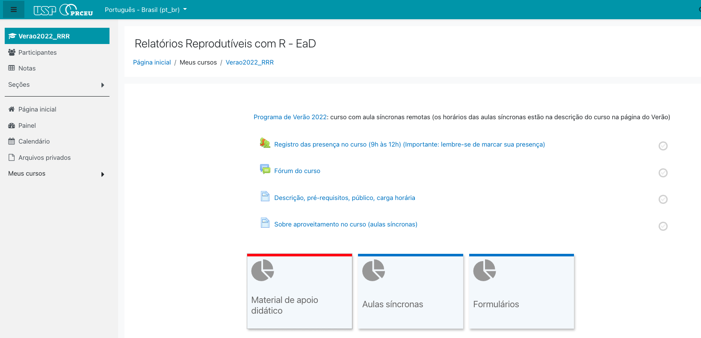
```

]

.pull-right[
Apenas pessoas inscritas tem acesso:

- Registro de presença

- Acesso às aulas síncronas

- Acesso às aulas gravadas;

- Acesso aos links para formulários de acompanhamento

- Fórum para enviar dúvidas

- Recados e avisos

]

---

### Página auxiliar

.pull-left[

https://beatrizmilz.github.io/2022-curso-de-verao-ime-usp-relatorios/

```{r}
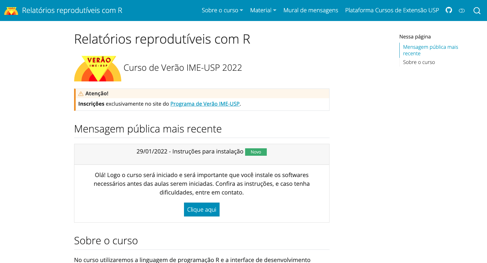
```

]

.pull-right[
Aberto para todas as pessoas:

- [Slides](https://beatrizmilz.github.io/2022-curso-de-verao-ime-usp-relatorios/slides/)

- [Informações sobre as pessoas docentes](https://beatrizmilz.github.io/2022-curso-de-verao-ime-usp-relatorios/profs.html)

- [Instruções de instalação](https://beatrizmilz.github.io/2022-curso-de-verao-ime-usp-relatorios/instrucoes-de-instalacao.html)

- [Programação do curso](https://beatrizmilz.github.io/2022-curso-de-verao-ime-usp-relatorios/programacao-do-curso.html)

- [Direcionamentos para o trabalho final](https://beatrizmilz.github.io/2022-curso-de-verao-ime-usp-relatorios/trabalho_final.html)

]

---

### Objetivos de aprendizagem

Que vocês saibam ao final do curso:

- Noções de reprodutibilidade

- Como criar documentos usando RMarkdown.

- Como exportar esses documentos em word, PDF e HTML.

- Como controlar as versões do documento usando o Git e GitHub.

- Como disponibilizar o documento na internet. 

**Vamos alinhar baseado nas respostas do formulário pré-curso?**

---

### Dinâminca de aula

- Aula terá momentos de apresentação teórica, demonstração com live-coding, e exercícios.

- Para cada aula, teremos um formulário (Google Forms) que deverá ser respondido após as aulas. As perguntas são relacionadas ao acompanhamento do conteúdo e configuração das ferramentas necessárias. 

- **Últimos 15 minutos de cada aula serão para responder esse formulário e tirar dúvidas**.

- Intervalo: a cada 1h de aula, faremos uma pequena pausa. Tentem ficar longe da tela! 

  - 10h00 - 5 min

  - 11h00 - 5 min 

---

### Informações gerais

- Gravação das aulas: caso não queira aparecer na gravação, mantenha sua câmera fechada.

```{r, out.width="30%"}

```


- Dúvidas:

  - Durante as aulas: enviem dúvidas no chat.

  - Fora do horário de aulas:
      - Durante o oferecimento do curso: [na plataforma USP Extensão](https://cursosextensao.usp.br/mod/forum/view.php?id=160206)
      - Após a finalização do curso: [Fórum da Curso-R](https://discourse.curso-r.com/)


---

### Requisitos para o certificado


- Teremos um trabalho final, que deverá ser entregue até **20/02** (1 semana após o final do curso). O trabalho final é obrigatório para o recebimento do certificado.

- Certificado = Ter **frequência igual ou superior à 75%** (ou seja, pode ter 1 falta) + entrega do trabalho final.


---

### Estrutura do curso

- São 5 aulas: 

  - Aulas 1 e 2: conceito de reprodutibilidade, usar projetos em R e introdução ao pacote RMarkdown.
  
  - Aulas 3 e 4: introdução ao Git e GitHub no RStudio.
  
  - Aula 5: exemplo para praticar os conteúdos das aulas anteriores.
  

---
name: instalacao
class: middle, center, inverse

## Instalações

[Veja aqui!](https://beatrizmilz.github.io/2022-curso-de-verao-ime-usp-relatorios/instrucoes-de-instalacao.html)

---

### Check-list


- Instalar:
  - [R](https://livro.curso-r.com/1-1-instalacao-do-r.html)
  - [RStudio](https://livro.curso-r.com/1-1-instalacao-do-r.html) 
  - [Git](https://git-scm.com/)

- [Criar uma conta no GitHub](https://github.com/)

---

### Check-list de pacotes

- Instalar pacotes necessários:

```r
pacotes_necessarios <- c(
  "usethis",
  "devtools",
  "rmarkdown",
  "knitr",
  "pagedown",
  "bookdown",
  "xaringan",
  "readr",
  "dplyr",
  "DT",
  "reactable",
  "janitor",
  "prettydoc"
)
install.packages(pacotes_necessarios)
```


---

### Guia dos slides

- As cores da linha vertical indicam o tipo de conteúdo dos slides!

  - Cinza: conteúdo teórico, expositivo.
  
  - Azul: demonstração, mostraremos como é feito no RStudio.
  
  - Amarelo: vocês fazem exercícios para praticar o que foi apresentado.
  
  - Coral: pontos principais para revisão teórica.

---
name: reprodutibilidade
class: middle, center, inverse

## Introdução ao conceito de reprodutibilidade

.left[
- O que vamos aprender:

  - O que é reprodutibilidade?

  - O que são projetos no RStudio, e qual é a importância de usá-los? 

  - O que são caminhos relativos e absolutos?

  - Como desabilitar a funcionalidade do RStudio que armazena automaticamente os objetos e o histórico?
]

---
class: teoria

.pull-left[
### Reprodutibilidade

- "É um conceito que não tem uma definição única e comum". [(Gundersen, 2021)](https://doi.org/10.1098/rsta.2020.0210)

- "Para alguém fazer uma afirmação científica legítima, ele deve ser capaz de reproduzir totalmente seus resultados a partir de seus dados brutos (e de preferência outros devem ser capazes de reproduzi-los também)". [Dr. John Paul Helveston](https://jhelvy.github.io/r4aPrimer/L6-reproducible-reporting.html)

 
]

--

.pull-right[

Quais fatores contribuem com  pesquisa não reprodutível? Fonte: <a href='https://doi.org/10.1038/533452a'>Baker (2016)</a>

```{r echo=FALSE, out.width="100%"}
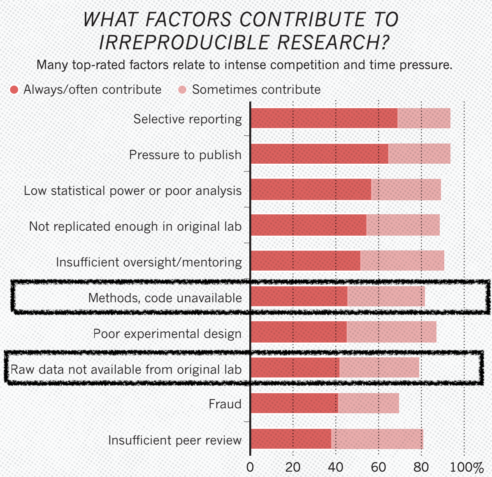
```


]


---
class: teoria

.pull-left[

### Reprodutibilidade


> “Reprodutibilidade é como escovar os dentes. Isso é bom para você, mas leva tempo e esforço. Depois de aprender, torna-se um hábito.” - Irakli Loladze, Bryan College of Health Sciences em Lincoln, Nebraska.  
  > .small[Baker, M. 1,500 scientists lift the lid on reproducibility. Nature 533, 452–454 (2016). https://doi.org/10.1038/533452a]

]

--

.pull-right[
- Exemplos:

  - Boas práticas, como: não usar caracteres especiais nos caminhos, variáveis, nomes de coluna, etc; armazenar os arquivos de forma consistente.

  - Registrar a versão do R e dos pacotes utilizados
  
  - Documentar a análise
  
  - Controlar a versão dos arquivos
]

???

Outras referências interessantes:

- [Introduction to bioinformatics -  Chapter 8 Reproducible research, - Laurent Gatto](https://uclouvain-cbio.github.io/WSBIM1207/sec-rr.html)


---
class:  teoria

### Projetos do RStudio

.pull-left[

- O RStudio permite a criação de Projetos.


- O projeto é uma pasta no computador, onde devemos armazenar todos os arquivos usados ou criados em uma análise. Essa pasta irá conter também um arquivo com o nome do projeto e a extensão `.Rproj`.

- Para cada análise, lembre-se de criar um `.Rproj` correspondente.


]

.pull-right[

- Usar projetos no RStudio facilita a organização dos arquivos, posteriormente sincronizar com o GitHub, entre outros.

```{r echo=FALSE, out.width="50%"}
knitr::include_graphics("img/rprojs.png")
```

]


---
class: livecoding

### Criando um projeto

- Criando um projeto em uma nova pasta:

  - File > New Project > New Directory > New Project
  
  - Dê um nome para seu projeto (será o nome da pasta), escolha a pasta no seu computador, e clique em `Create Project`.
  
  
---
class:  teoria

### Diretório de trabalho/Working Directory

- O diretório de trabalho é a pasta em que o R irá:
  - procurar arquivos na hora de ler informações;
  - gravar arquivos na hora de salvar objetos.


- Quando usamos Projetos do RStudio, o nosso diretório de trabalho é a pasta principal do projeto. 

- A função `getwd()` serve para conferir o diretório de trabalho: 

```r
> getwd()
[1] "/Users/beatrizmilz/GitHub/2022-curso-de-verao-ime-usp-relatorios"
```

- A função `setwd()` serve para alterar o diretório de trabalho. **NÃO É RECOMENDADO O USO! Isso torna o código não reprodutível.**

  
---
class:  teoria

### Caminhos

- Caminhos são textos que representam o endereço do arquivo no computador. 

- É muito importante entender como funcionam! Caso contrário, ficará difícil fazer coisas como importar dados para o R.

- Caminhos podem ser relativos ou absolutos.

- Caminhos absolutos: tem início na pasta raiz do seu computador/usuário. **NÃO É RECOMENDADO O USO! Isso torna o código não reprodutível.**

- Caminhos relativos: tem início no diretório de trabalho da sessão. Caso você esteja usando projetos, os caminhos relativos tem início na pasta inicial do projeto. 


- **Utilize sempre que possível caminhos relativos.**

---
class:  teoria

### Exemplos de caminhos

Exemplos acessando o mesmo arquivo:

- Caminho absoluto:
```
"/Users/beatrizmilz/GitHub/2022-curso-de-verao-ime-usp-relatorios/docs/slides/img/rprojs.png"
```

- Caminho relativo:
```
"docs/slides/img/rprojs.png"
```


???
O pacote `here` também possui funções úteis para escrever caminhos: 

```{r echo=TRUE}
here::here()
```

---
class:  teoria

### Os arquivos .RData e .Rhistory 

- Em sua configuração padrão, a IDE manterá na "memória" todos os últimos comandos executados, todos os dados utilizados e todos os objetos criados.

- Ao fechar e abrir o RStudio, essas informações serão recarregadas na memória como se o usuário nunca tivesse saído do programa. Esse recurso é tornado possível pela criação de dois arquivos ocultos: `.RData` e `.Rhistory`.

- O primeiro abriga absolutamente todos os objetos criados por uma sessão R, enquanto o segundo contém uma lista com os últimos comandos executados. 

- Ao reabrir o RStudio, o conteúdo armazenados nestes arquivos será carregado no ambiente de trabalho atual como se nada tivesse acontecido.

.footnote[Leia mais [neste capítulo do livro Zen do R](https://curso-r.github.io/zen-do-r/rdata-rhistory.html)]


```{r echo=FALSE, results='asis'}
ref_pacotes_curso_r()
```


---
class:  teoria


### Por que desistir do .RData e .Rhistory 

- Se todos os resultados parciais de uma análise estiverem disponíveis a qualquer momento, **diminui o incentivo para a escrita de código reprodutível**

- Ao dependermos ativamente do `.Rdata`, **se acidentalmente sobrescrevemos um objeto** relevante e o código para recriá-lo não estiver mais acessível, **não haverá nenhuma forma confiável de recuperá-lo**.

- O R trata todos os objetos guardados na memória igualmente. Isso significa que ele também irá armazenar nos arquivos ocultos todas as bases de dados da sessão. Assim, o `.RData` **pode ser um arquivo de múltiplos gigabytes**

```{r echo=FALSE, results='asis'}
ref_pacotes_curso_r()
```


---
class:  livecoding

### Como desabilitar .RData e .Rhistory

- Na barra superior: **Tools > Global Options...**

```{r, echo=FALSE, out.width="40%"}
knitr::include_graphics("https://curso-r.github.io/zen-do-r/static/rdata-rhistory/config.png")
```

```{r echo=FALSE, results='asis'}
ref_pacotes_curso_r()
```

---
class: exercicios

### Colocar em prática

1) Crie um projeto no RStudio para armazenar o que vamos criar durante o curso. Salve em algum lugar no seu computador que seja fácil de encontrar.

2) Desabilite o .RData e .Rhistory no seu RStudio

3) Execute o seguinte código no console, verifique o resultado: `devtools::session_info()`

4) Dentro do projeto criado, crie uma pasta chamada "dados", e salve o seguinte arquivo na mesma: [clique aqui para baixar o arquivo `pinguins.csv`](https://beatrizmilz.github.io/2022-curso-de-verao-ime-usp-relatorios/dados/pinguins.csv)

Dados originais: https://allisonhorst.github.io/palmerpenguins/

Dados traduzidos para Português: https://cienciadedatos.github.io/dados/

---
class: exercicios

### Colocar em prática: Continuação

5) Crie um R Script, copie e cole o código abaixo, e substitua o caminho correto para ler a base de pinguins. Aproveite que o RStudio nos ajuda a buscar caminhos: dentro das aspas, experimente clicar a tecla TAB.

```r
caminho <- "...." 
pinguins <- readr::read_csv(caminho)
```
6) Verifique no painel Environment do RStudio se a base de Pinguins foi importada corretamente.


---
class: livecoding

- Exemplo do Session Info

.smaller[
```{r echo=TRUE}
devtools::session_info()
```
]

---
class: revisao

### Revisão - Reprodutibilidade

- Em um código reprodutível, devemos ser capazes de reproduzir totalmente os resultados a partir dos dados brutos, assim como outras pessoas (em computadores diferentes) também devem ser capazes de reproduzir esses mesmos resultados a partir dos dados brutos.

- Utilizar boas práticas aumentam as chances de escrever um código reprodutível. 
- Exemplos de boas práticas:

  - Utilizar Projetos do RStudio. Quando usamos projetos do RStudio, o diretório de trabalho será a pasta principal do projeto.

  - Desabilitar o .Rhistory e .Rdata.

  - Utilizar caminhos relativos.

---
name: rmarkdown
class: middle, center, inverse

## RMarkdown

.left[
- O que vamos aprender:

  - O que é o pacote rmarkdown?

  - Qual é a estrutura de um arquivo rmarkdown?
  
  - O que é Markdown?
  
  - Como adicionar conteúdo em um arquivo rmarkdown?

  - Como gerar outros tipos de documentos?
  

]

---
class:  teoria


### Ciclo da ciência de dados


```{r, out.width="65%"}
knitr::include_graphics("https://beatrizmilz.github.io/python-brasil-2021-reticulate/img/environmental-data-science-r4ds-general.png")
```


Fonte: Conceito do ciclo de ciência de dados apresentado por [Hadley Wickham no livro R for Data Science](https://r4ds.had.co.nz/introduction.html), ilustração por [Allison Horst](https://github.com/allisonhorst).

---
class:  teoria


### Pacote R Markdown

.pull-left[


- Criado e mantido pela [RStudio](https://rstudio.com/)

- Princípio: arquivos onde escrevemos textos e marcamos com `markdown`, mas também podemos adicionar códigos que são executados.

- Extensão `.Rmd`

- Possibilita a utilização de códigos `R`, `Python`, `Markdown`, `HTML`, `CSS`, `SQL`, e outros em um único arquivo.

]

.pull-right[
```{r, out.width="70%", fig.cap="<center><b>Logo: <a href='https://rmarkdown.rstudio.com'>Pacote rmarkdown</a></b></center>"}
knitr::include_graphics("https://beatrizmilz.github.io/python-brasil-2021-reticulate/img/hex-rmarkdown.png")
```
]

---
class:  teoria


### Pacote R Markdown


.pull-left[
- A reprodutibilidade é algo importante para o R Markdown.

-  A comunidade de R, e a equipe da RStudio, desenvolveram outros pacotes que integram bem com R Markdown para  gerar diversos produtos de análise de dados diferentes, com arquivos .Rmd. 

]

.pull-right[
```{r, out.width="70%", fig.cap="<center><b>Fonte: <a href='https://rmarkdown.rstudio.com'>Pacote `rmarkdown`</a></b></center>"}
knitr::include_graphics("https://beatrizmilz.github.io/slidesR/img/rmarkdown/markdown.png")
```
]


---
class:  livecoding


### Começando com o R Markdown 

- **Criando um arquivo**:

  - `File > New File > R Markdown`

- **Estrutura do arquivo**: 

  - YAML - metadados do documento
  - Code chunks - Campos de código (pode receber código em R, SQL, Python, entre outros)
  - Textos marcados com Markdown ou HTML

- **Transformar o .Rmd no arquivo final**
  - Botão Knit, ou usando o atalho: `Ctrl + Shift + K`
  - Boa prática: faça isso com frequência. 
  
---
class: exercicios

### Colocar em prática: 
  
- Dentro do projeto do RStudio criado, crie uma pasta chamada `relatorio`.

- Crie um novo arquivo RMarkdown que gera um HTML, e salve ele na pasta `relatorio`. Dê o nome de `primeiro_relatorio.Rmd`.

- O arquivo já vem com alguns conteúdos para servir de exemplo. Observe a estrutura deste arquivo! Tente imaginar o que será gerado.

- Aperte o botão `knit` para gerar o resultado final. Veja o resultado: é o que você imaginou?

- Faça pequenas alterações e aperte o botão `knit` novamente, para ver como ficou. Sugestões:
  - Altere o título, adicione seu nome, mude a data.
  - Escreva algo diferente no corpo do arquivo.
  


---
class:  teoria


### Markdown

- O RMarkdown possibilita a utilização da linguagem de marcação simples Markdown. Essa linguagem de marcação foi elaborada para ser fácil de ler e  fácil de escrever.

* Confira as cheatsheets: [`rmarkdown` Cheatsheet 2.0](http://www.rstudio.com/wp-content/uploads/2016/03/rmarkdown-cheatsheet-2.0.pdf) e [`rmarkdown` Cheatsheet](https://www.rstudio.com/wp-content/uploads/2015/02/rmarkdown-cheatsheet.pdf).


- O RStudio Visual Editor facilita o uso do Markdown no RStudio.

---
class: livecoding

### Markdown

.pull-left[
- Negrito, itálico, tachado

- Criar títulos

- Listas
  - Enumerada
  - Não enumerada
]

.pull-right[
- Marcar como código

- Marcar como citação

- Links

- Imagens
]


---
class: exercicios

### Colocar em prática: 

- No arquivo criado, experimente marcar os textos com Markdown.

- Experimente o Visual Mode Editor do RStudio.

- Adicione um link no seu relatório para a página dos cursos de extensão da USP: https://cursosextensao.usp.br/

---
class:  teoria

### Chunks de Código em R

- Os chunks são campos onde podemos inserir código de R (ou Python, SQL,  Bash...) em um arquivo RMarkdown. 


- Os chunks podem ter rótulos/nomes, para identificar o conteúdo gerado.


- Existe um atalho do teclado para criar chunks no RStudio:  `Ctrl + ALt + I`. 

- Também é possível criar um chunk clicando no seguinte botão do RStudio:


```{r echo=FALSE, out.width="90%"}
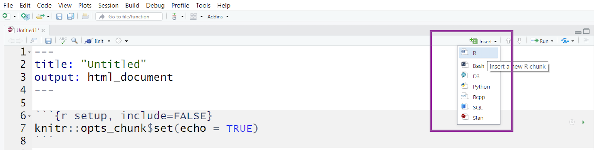
```

---
class:  teoria

### Opções de Chunk

- Há uma variedade de opções de chunk que podem afetar como os chunks de código são compilados. Exemplos: 

- `echo=FALSE`- evita que o próprio código apareça

- `eval=FALSE` - mostra o código, mas ele não é executado

- `warning=FALSE` e `message=FALSE` - oculta mensagens de avisos produzidas

- `out.width` - controla o a largura das figuras, gráficos, tabelas geradas (Ex: out.width = "100%")

- Ex de configuração do chunk: `{r, warning=FALSE, message=FALSE}`


---
class:  teoria

### Códigos em R - Opções de chunk

.pull-left[
#### Código + Resultado
- `echo=TRUE`
```{r echo=TRUE}
nrow(mtcars)
```
]

.pull-right[

#### Apenas código
- `echo=TRUE, eval=FALSE`
```{r echo=TRUE, eval=FALSE}
nrow(mtcars)
```

#### Apenas resultado
- `echo=FALSE`
```{r echo=FALSE}
nrow(mtcars)
```

]


---
class:  teoria

### Diretório de trabalho em arquivos `.Rmd`

- Quando usamos projetos do RStudio, o diretório de trabalho será a pasta principal do projeto.

- Quando estamos trabalhando com arquivos `.Rmd`, por padrão o diretório de trabalho DO ARQUIVO será a pasta onde o arquivo está localizado.

- Isso gera confusão! Atenção pois isso pode causar erros. Uma dica para escrever os caminhos de forma correta é utilizar a funcionalidade do RStudio: escreva aspas, coloque o cursor entre as pastas e aperte TAB.

- Exemplo prático: comparar o uso de `getwd()` dentro e fora de um arquivo `.Rmd`.

- Para acessar arquivos em pastas que estão em um "nível" anterior ao diretório de trabalho, utilize `"../"`. 

---
class: exercicios

### Colocar em prática: 

.pull-left[
1) No arquivo `primeiro-relatorio.Rmd`, crie um chunk e faça a importação da base de dados de pinguins.

```r
caminho <- "...." 
pinguins <- readr::read_csv(caminho)
dplyr::glimpse(pinguins)
```

2) Lembre-se de se atentar aos caminhos! Atualmente o projeto deve estar estruturado dessa forma:

]
.pull-right[

````
├── dados
│   └── pinguins.csv
├── relatorios
│   ├── primeiro-relatorio.Rmd
└── projeto.Rproj
```

3) Aperte `knit` e observe o resultado. O código e o resultado deverá aparecer no relatório. Configure as opções de chunk para que apareça corretamente.
]

---
class:  teoria

### Opções globais de Chunk

As opções globais de chunk são opções de chunk que são válidas para o documento inteiro. Algumas opções são úteis, como `fig.align = "center"`.
Para configurar as opções globais de chunk, modifique o código abaixo e insira após o código `YAML` (retire os `#` no início de cada linha):

- Ex:
  - Configurações do chunk:
`{r setup, include=FALSE}`
  - Conteúdo do chunk:
`knitr::opts_chunk$set(...)`

---
class: exercicios

### Colocar em prática: 

1) Adicione no seu relatório um chunk com o código para carregar o pacote dplyr: `library(dplyr)`

2) Aperte o botão `knit` para ver o resultado. Repare que logo após o código aparece uma mensagem:

```
Attaching package: 'dplyr'
The following objects are masked from 'package:stats':

    filter, lag
```

3) Altere a opção global de chunk, de forma que não apareçam essas mensagens. 

4) Aperte o botão `knit` para ver o resultado. Observe o que mudou.

---
class:  teoria

### Código inline

- É útil para adicionar resultados de código em R dentro de parágrafos.


**Exemplo:**

A base mtcars possui `r nrow(mtcars)` carros.
As colunas presentes na base são 
`r knitr::combine_words(names(mtcars), and = "e ")`.

**Código Markdown:**


```{r eval=FALSE, echo=TRUE}
A base mtcars possui `r nrow(mtcars)` carros.
As colunas presentes na base são 
`r knitr::combine_words(names(mtcars), and = "e ")`.
```


---
class: exercicios

### Colocar em prática: 

```{r include=FALSE}
caminho <- "../dados/pinguins.csv" 
pinguins <- readr::read_csv(caminho)
```

1 ) O trecho a seguir apresenta um texto com resultados feitos com inline code. Adicione o seguinte código no seu relatório (o arquivo `primeiro_relatorio.Rmd`), substituindo os trechos coloridos por inline code:

> A base de dados pinguins apresenta dados referente à .colorido[`r nrow(pinguins)`] pinguins, das seguintes espécies: .colorido[`r knitr::combine_words(unique(pinguins$especie), and = "e ")`]. Os dados foram coletados entre os anos .colorido[`r min(pinguins$ano)`] e .colorido[`r max(pinguins$ano)`], nas seguintes ilhas: .colorido[`r knitr::combine_words(unique(pinguins$ilha), and = "e ")`]. O peso médio dos pinguins amostrados foi de .colorido[`r round(mean(pinguins$massa_corporal, na.rm = TRUE)/100)`] kg. Os dados foram obtidos através do pacote [Palmer Penguins](https://allisonhorst.github.io/palmerpenguins/).


---
class:  teoria

### Adicionando imagens usando o knitr

.pull-left[
- Função: `knitr::include_graphics()`

-  Opções de Chunk: 

  - `out.width = "30%"` - Largura da imagem

  - `fig.align = 'center'`  - Alinhamento da imagem

  - `fig.cap="Logo R"` - Legenda da imagem 
]

.pull-right[

Exemplo:


```{r  out.width = "30%", fig.align = 'center', fig.cap="Logo R"}
knitr::include_graphics("https://www.r-project.org/Rlogo.png")
```

Sugestão de leitura: [Opções do knitr](https://yihui.name/knitr/options/#chunk-options)


]


---
class: exercicios

### Colocar em prática: 

1) No seu relatório (o arquivo `primeiro_relatorio.Rmd`), utilizando R, adicione as seguintes imagens. Deixe-as centralizadas, sem que apareça o código, e ocupando 80% da largura da página:

a) Utilize a URL: https://allisonhorst.github.io/palmerpenguins/reference/figures/lter_penguins.png

b)  Na pasta inicial do projeto, crie uma pasta chamada `img/`. Nesta pasta, salve a imagem, e adicione a imagem no relatório utilizando caminhos relativos: https://allisonhorst.github.io/palmerpenguins/reference/figures/logo.png


---
class:  teoria

### Tabelas com R

- Várias opções: `knitr::kable()`, `DT::datatable()` , `reactable::reactable()`, entre outras.

```{r echo=TRUE}
mtcars |>
  head(3) |>
  knitr::kable()
```


---
class: exercicios

### Colocar em prática: 

1) Adicione a seguinte tabela no seu relatório, usando a função `kable()`:

```{r echo=TRUE}
quantidade_de_especies <- pinguins |>
  dplyr::count(especie, sort = TRUE) |>
  janitor::adorn_totals()
```

Ela deverá ficar assim:

```{r echo = FALSE}
quantidade_de_especies |>
  knitr::kable(col.names = c("Espécie", "Quantidade"))
```


---
class:  teoria

### Erros!

- Boa prática: compilar com frequência. 

- É bem comum dar erro ao compilar o arquivo pois **qualquer** código errado causa isso. Algumas coisas pra se observar:

  - **YAML header** - se algo estiver errado, vai dar erro ao compilar. 
Muito cuidado com a identação!

  - **Código nos chunks** - teste o _Run All Chunks_ e veja se aparece erro em algum chunk específico.
Se descobrir, tente verificar o que há de errado no código (pode ser a falta de um parênteses, vírgula, entre outros).

  - Todos os objetos e pacotes usados no seu script precisam estar disponíveis no seu `.Rmd`. Verifique isso :)
  
  


---
class: livecoding

### Gerando outros tipos de arquivos

- Alterando o output no YAML. Ex:

  - Word: `output: word_document` ou `output: bookdown::word_document2`

  - HTML: `output: html_document`  
  
- Gerando PDFs a partir de HTML:

  - Usando a função `pagedown::chrome_print("caminho/ate/arquivo.html")`
  
  - Adicionando a linha no YAML: 
  `knit: pagedown::chrome_print`
  

---
class: exercicios

### Colocar em prática: 


1) Gere um PDF com o seu relatório utilizando a função `pagedown::chrome_print("caminho/ate/arquivo.html")`.

2) Gere uma versão em word do seu relatório, alterando o `output` no YAML.

---
class: livecoding

### Templates de R Markdown

.pull-left[

  -  Pacotes também oferecem templates (`File > New File > R Markdown > From template`).
  
  - Os templates disponíveis dependem dos pacotes instalados.
  
]

.pull-right[  
```{r, out.width="90%"}
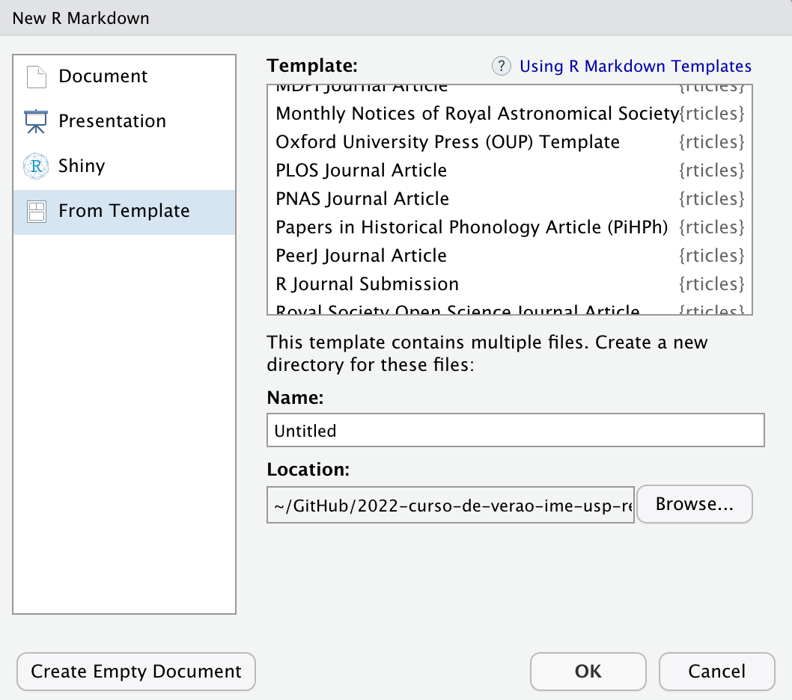
```
]

---
class: teoria
### Exemplos

.small[
```{r echo=FALSE}
exemplos_rmd <- tibble::tibble(pacote = as.character(),
               desc = as.character(),
               exemplos = as.character()) |> 
  
  tibble::add_row(pacote = "[blogdown](https://bookdown.org/yihui/blogdown/)",
                  desc = "Blogs e sites",
                  exemplos = "- [Site da Curso-R](https://curso-r.com/) <br> - [Site da Associação Brasileira de Jurimetria (ABJ)](https://abj.org.br/)") |> 
  
  tibble::add_row(pacote = "[distill](https://rstudio.github.io/distill/)",
                  desc = "Blogs e sites",
                  exemplos = "- [RStudio AI Blog](https://blogs.rstudio.com/ai/) <br> - [Laboratório da Associação Brasileira de Jurimetria (ABJ)](https://lab.abj.org.br/)") |> 
  
  tibble::add_row(pacote = "[bookdown](https://bookdown.org/)",
                  desc = "Livros",
                  exemplos = "- [Livro Ciência de Dados em R](https://livro.curso-r.com/) <br> - [R for Data Science](https://r4ds.had.co.nz/)") |> 
  
  tibble::add_row(pacote = "[xaringan](https://github.com/yihui/xaringan) e [xaringanthemer](https://pkg.garrickadenbuie.com/xaringanthemer/)",
                  desc = "Apresentações",
                  exemplos = "- Essa apresentação <br> - [Build Your Own Universe - Garrick Aden-Buie & Travis Gerke](https://www.garrickadenbuie.com/talk/build-your-own-universe/)") |> 
  
  tibble::add_row(pacote = "[pagedown](https://github.com/rstudio/pagedown)",
                  desc = "Currículos, cartas e trabalhos acadêmicos",
                  exemplos = "- [Relatório do Observatório da Insolvência](https://abjur.github.io/obsFase2/relatorio/obs_recuperacoes_abj.pdf) <br>  - [Meu currículo](https://beatrizmilz.github.io/resume/index.html) ") |> 


  tibble::add_row(pacote = "[learnr](https://rstudio.github.io/learnr/)",
                  desc = "Tutoriais interativos",
                  exemplos = "- [Text mining with tidy data principles](https://juliasilge.shinyapps.io/learntidytext/) <br> - [Teacups, Giraffes,  & Statistics](https://tinystats.github.io/teacups-giraffes-and-statistics/)") |> 
  
  tibble::add_row(pacote = "[flexdashboard](https://pkgs.rstudio.com/flexdashboard/)",
                  desc = "Dashboards estáticos",
                  exemplos = "- [Exemplos da documentação](https://pkgs.rstudio.com/flexdashboard/articles/examples.html) <br> - [A COVID-19 em Sorocaba - Por Victor Dogo](https://victordogo.github.io/covid19-sorocaba/)") |> 
  
  tibble::add_row(pacote = "[rticles](https://github.com/rstudio/rticles)",
                  desc = "Artigos científicos",
                  exemplos = "   ") |>  
  tibble::add_row(pacote = " ",
                  desc = "Outros exemplos",
                  exemplos = "[Newsletter Garimpo](https://nucleo.jor.br/newsletters/garimpo)") 
  


exemplos_rmd |> 
  dplyr::slice(1:7) |>  
  knitr::kable(col.names = c("Pacote", "O que podemos fazer?", "Exemplos"))
```
]

```{r echo=FALSE, results='asis'}
ref_relatorios_curso_r()
```


---
class: teoria
### Exemplos


.pull-left[
- Outros pacotes:

  - [rticles](https://github.com/rstudio/rticles)

  - [bslib](https://rstudio.github.io/bslib/)

  - [rmdformats](https://github.com/juba/rmdformats)

  - [officedown](https://github.com/davidgohel/officedown) 

  - [postcards](https://github.com/seankross/postcards)

]

.pull-right[
- Podemos criar!

  - [abjTemplates](https://github.com/abjur/abjTemplates)

  - [RLadiesTheme](https://github.com/R-Ladies-Sao-Paulo/RLadiesTheme)
]


---
class: exercicios

### Colocar em prática: 

1) No seu relatório, substitua no YAML output pelo seguinte código, aperte `knit` e observe o resultado:

```
output:
  prettydoc::html_pretty:
    theme: architect
```
2) Experimente algum dos temas seguintes: cayman, tactile, architect, leonids, hpstr. Aperte knit e observe o resultado. Qual tema vocês mais gostaram?


---
class: revisao

### Revisão - R Markdown

- O pacote rmarkdown possibilita  adicionar textos e códigos em um único arquivo.

- Podemos utilizar códigos em R, Python, Markdown, HTML, CSS, SQL, e outros no RMarkdown.


- O arquivo RMarkdown é estruturado em: YAML (metadados), textos marcados e campos de código (chamados de chunks).

- Markdown é uma linguagem de marcação que possibilita marcar textos. Essa linguagem é utilizada nos arquivos RMarkdown e em muitos outros lugares. 

- Os tipos mais básicos de arquivos exportados pelo RMarkdown são páginas de internet `.html`, arquivos word `.docx`, e arquivos `.pdf`. Existem muitos pacotes para expandir as possibilidades do RMarkdown e fazer outros tipos de documentos, como: livros, documentos científicos, currículos, blogs, sites, entre outros.


---
name: rmarkdown-extra
class: middle, center, inverse

## RMarkdown - Conteúdo extra

.left[

- Como adicionar parametros no relatório
  
- Como adicionar equações
  
- Como adicionar referências

- Como citar o R em relatórios
  
- Como citar pacotes

- Como usar um modelo de word para gerar um relatório

- Como fazer referência cruzada
  

]


---
class: teoria

### Parâmetros


.pull-left[

Devemos adicionar os parâmetros (e algum valor padrão) no YAML. 

Ex:


```
---
title: "Relatório com Parâmetros"
author: "Beatriz"
date: "Fevereiro de 2022"
output: html_document
params:
  mes: 12
  ano: 2021
---
```
]


.pull-right[

Para acessar os parâmetros, usamos: `params$nome_parametro`.

Ex: `params$mes` para acessar o mês, ou `params$ano`.


Recomendação de leitura: [R Markdown: The Definitive Guide - Chapter 15 Parameterized reports](https://bookdown.org/yihui/rmarkdown/parameterized-reports.html)

]


---
class: teoria

### Adicionar equações

- Podemos adicionar equações em LaTeX. Dica: [Equações em LaTeX no Mettzer](https://app.mettzer.com/latex), ou pesquise no google por "Equações em LaTeX".
  
- Equação centralizada: Envolver a equação por dois `$`.

$${\text{Média}=\frac {a_{1}+a_{2}+\cdots +a_{n}}{n}}$$

  - Equação junto ao texto: Envolver a equação por um `$`.

> Ou também na linha ${\text{Média}=\frac {a_{1}+a_{2}+\cdots +a_{n}}{n}}$, junto ao texto!

**Código Markdown:**


```md
$${\text{Média}=\frac {a_{1}+a_{2}+\cdots +a_{n}}{n}}$$
```

---
class: teoria

### Adicionar referências

- Podemos adicionar referências no texto usando um arquivo `.bib`. 

- Podemos gerar um arquivo `.bib` usando um gerenciador de referências. Eu utilizo o [Zotero](https://www.zotero.org/), a extensão [Better Bibtex for Zotero](https://retorque.re/zotero-better-bibtex/installation/) e a extensão do Zotero para o navegador.

- No arquivo `.bib`, cada referência deverá ter um rótulo, que usaremos para citar dentro do arquivo `.Rmd`, precedido de `@`.

- Devemos indicar os arquivos `.bib` no YAML do relatório. Exemplo em um caso com 2 arquivos diferentes:

```
bibliography: [referencias/packages.bib, referencias/zotero.bib]
```
  

---
class: teoria

### Citar o R - Função citation()

.smaller[
```
> citation() 

To cite R in publications use:

  R Core Team (2021). R: A language and environment for
  statistical computing. R Foundation for Statistical
  Computing, Vienna, Austria. URL https://www.R-project.org/.

A BibTeX entry for LaTeX users is

  @Manual{,
    title = {R: A Language and Environment for Statistical Computing},
    author = {{R Core Team}},
    organization = {R Foundation for Statistical Computing},
    address = {Vienna, Austria},
    year = {2021},
    url = {https://www.R-project.org/},
  }

We have invested a lot of time and effort in creating R,
please cite it when using it for data analysis. See also
‘citation("pkgname")’ for citing R packages.
```
]

---
class: teoria

### Citar pacotes

- Podemos gerar um `.bib` com as referências de pacotes utilizados usando a função `knitr::write_bib()`:

```{r echo=TRUE}
pacotes <- c("tidyverse")
knitr::write_bib(pacotes, # pacotes para gerar a referencia
                 # local para salvar o arquivo
                 'packages.bib')
```

---
class: teoria


````
@Manual{R-tidyverse,
  title = {tidyverse: Easily Install and Load the Tidyverse},
  author = {Hadley Wickham},
  year = {2021},
  note = {R package version 1.3.1},
  url = {https://CRAN.R-project.org/package=tidyverse},
}

@Article{tidyverse2019,
  title = {Welcome to the {tidyverse}},
  author = {Hadley Wickham and Mara Averick and Jennifer Bryan and Winston Chang and Lucy D'Agostino McGowan and Romain François and Garrett Grolemund and Alex Hayes and Lionel Henry and Jim Hester and Max Kuhn and Thomas Lin Pedersen and Evan Miller and Stephan Milton Bache and Kirill Müller and Jeroen Ooms and David Robinson and Dana Paige Seidel and Vitalie Spinu and Kohske Takahashi and Davis Vaughan and Claus Wilke and Kara Woo and Hiroaki Yutani},
  year = {2019},
  journal = {Journal of Open Source Software},
  volume = {4},
  number = {43},
  pages = {1686},
  doi = {10.21105/joss.01686},
}
```


---
class: teoria

### Como citar no .Rmd


- Formas de usar os rótulos gerados no arquivo `.Rmd`:

```{r}
tibble::tibble(
  forma_de_citar = as.character(), resultado = as.character()
) |> 
  tibble::add_row(
    forma_de_citar = "@tidyverse2019",
    resultado = "Wickham et al. (2019)"
  )|> 
  tibble::add_row(
    forma_de_citar = "[@tidyverse2019; @R-tidyverse]",
    resultado = "(Wickham et al. 2019; Wickham 2021)"
  )|> 
  tibble::add_row(
    forma_de_citar = "Em -@tidyverse2019, Hadley e colaboradores...",
    resultado = "Em 2019, Hadley e colaboradores... "
  ) |> 
    tibble::add_row(
    forma_de_citar = "Segundo Hadley Wickham e colaboradores [-@tidyverse2019]",
    resultado = "Segundo Hadley Wickham e colaboradores (2019) "
  ) |> 
  knitr::kable()
```


---
class: teoria

### Formatação das referências

- O conteúdo do arquivo `.bib` é formatado a partir de um arquivo `.csl` (Citation Style Language).

- Devemos informar caminho até o arquivo CSL no YAML, por exemplo:

```
csl: template/abnt.csl
```

- Lugares para baixar arquivos CSL:

  - https://github.com/citation-style-language/styles
  - https://citationstyles.org/
  
---
class: teoria

### Usar um modelo para word

- Em alguns casos, somos obrigados a enviar arquivos `.docx` (ex: algumas revistas científicas apenas aceitam esse tipo de arquivo).

- Podemos informar um template de arquivo word como referência. As regras de formatação serão copiadas. Não funciona perfeitamente!

```
output: 
  bookdown::word_document2:
    reference_docx: template/modelo.docx
```  

---
class: teoria

### Exportar um `.docx` tunado

- Em alguns casos, somos obrigados a enviar arquivos `.docx` (ex: algumas revistas científicas apenas aceitam esse tipo de arquivo).

- Exemplo de YAML:

```
output: 
  bookdown::word_document2:
    reference_docx: template/modelo.docx
    number_sections: false
bibliography: [referencias/packages.bib, referencias/zotero.bib]
csl: template/abnt.csl
```    

---
class: teoria

### Referência cruzada - Elementos


- Funciona com outputs que são derivados do pacote bookdown. 
  - Ex: `bookdown::html_document2`,  `bookdown::word_document2`

- **Figuras, tabelas, equações, etc:**
  - Usamos o rótulo do chunk (ou nome) onde a tabela ou imagem foi criada para fazer a referência cruzada. 
    - Ex: `\@ref(fig:rotulo-da-imagem)` , `\@ref(tab:rotulo-da-tabela)`, ou `\@ref(eq:rotulo-da-equacao)`.
    - Referência: https://bookdown.org/yihui/rmarkdown-cookbook/cross-ref.html
    

---
class: teoria
    
### Referência cruzada - Capítulos/Seções


- Funciona com outputs que são derivados do pacote bookdown. 
  - Ex: `bookdown::html_document2`,  `bookdown::word_document2`
    
- **Capítulos:**
  - Para fazer referência cruzada em capítulos/seções, devemos adicionar um rótulo para o capítulo, que deverá ser escrito logo após a cabeçalho (que delimitamos com `#`, `##`, etc). Para referenciar no texto, devemos usar `\@ref(rotulo-do-capitulo)`.
    - Exemplo da criação do rótulo:  `# Introdução {#introducao}`
    - Exemplo de uso no texto: `\@ref(introducao)` . 
    - Referência: https://bookdown.org/yihui/bookdown/cross-references.html
    


  


---
name: git-e-github
class: middle, center, inverse


## Git e GitHub

.left[
- O que vamos aprender:

  - O que é controle de versão de arquivos?
  
  - O que é Git? O que é GitHub?
  
  - Como configurar de forma que possamos usar o Git e GitHub diretamente do RStudio?
  
  - Como disponibilizar um documento em RMarkdown na internet, usando o GitHub?

]


---
class: teoria

### Git

- Git é um **sistema de versionamento**, criado por Linus Torvalds, autor do Linux.

- É capaz de guardar o histórico de alterações de todos os arquivos dentro de uma pasta, que chamamos de repositório.

- Funciona como o "*Track changes*" do word, mas muito melhor.

- Torna-se importante à medida que seu trabalho é __colaborativo__.

- Git é um software que você instala no computador.

```{r echo=FALSE, out.width="30%", fig.align='center'}
knitr::include_graphics("img/git.png")
```


```{r echo=FALSE, results='asis'}
ref_pacotes_curso_r()
```


---
class: teoria

### GitHub

- GitHub é um site onde você coloca e compartilha repositórios Git.

- Utilizado por milhões de pessoas em projetos de código aberto ou fechado.

- Útil para colaborar com outros programadores em projetos de ciência de dados.

- Existem alternativas, como [GitLab](https://about.gitlab.com/) e [BitBucket](https://bitbucket.org/product).

- GitHub é um site que você acessa na internet.

<br>

```{r echo=FALSE, out.width="30%", fig.align='center'}
knitr::include_graphics("img/github.png")
```

```{r echo=FALSE, results='asis'}
ref_pacotes_curso_r()
```


---
class: teoria

### Protocolos 

- Podemos utilizar o protocolo `https` ou o protocolo `ssh` para acessar o GitHub através do RStudio.

- No geral, recomendamos usar o protocolo `https`.

### Quando usar SSH?

- Se você utiliza Linux, recomendamos usar o protocolo Secure Shell (`SSH`).


---

class: teoria


### Configurando o Git e GitHub no RStudio


####  Usando protocolo https

- `r emo::ji("white_large_square")` Ter o pacote `usethis` instalado 

- `r emo::ji("white_large_square")` Se apresentar para o `git` 

- `r emo::ji("white_large_square")` Criar um GitHub Token/PAT

- `r emo::ji("white_large_square")` Armazenar o GitHub Token/PAT 

- `r emo::ji("white_large_square")` Reiniciar o RStudio


```{r echo=FALSE, results='asis'}
ref_pacotes_curso_r()
```


---

class: teoria

### Configurando o Git e GitHub no RStudio


#### Usando protocolo SSH

- `r emo::ji("white_large_square")` Todas as etapas para o protocolo https (listadas no slide anterior)

- `r emo::ji("white_large_square")` Criar as chaves SSH no RStudio

- `r emo::ji("white_large_square")` Adicionar a chave SSH no SSH-agent

- `r emo::ji("white_large_square")` Adicionar as chaves públicas no  GitHub

- `r emo::ji("white_large_square")` Alterar o protocolo padrão no arquivo `.Rprofile`

- `r emo::ji("white_large_square")` Reiniciar o RStudio


Obs: Se você utiliza Linux, recomendamos usar `SSH`.


```{r echo=FALSE, results='asis'}
ref_pacotes_curso_r()
```


---

class: teoria

### Configure seu usuário do Git

Antes de começarmos a versionar o código do nosso projeto, vamos configurar o Git e o GitHub no RStudio. 

Esse processo precisa ser feito apenas uma vez!

```
usethis::use_git_config(
  user.name = "SEU NOME NO GITHUB",
  user.email = "seu_email_no@github.com"
)
```

- Em `user.name`, pode ser seu nome mesmo, não precisa ser o nickname.

- O `user.email` precisa ser o que está vinculado à sua conta do GitHub.

---

class: teoria

### Configure o Personal Access Token 

- Ao conectar com o GitHub, você será instruída(o) a criar um *Personal Access Token* (PAT).

- O PAT serve para autenticar ao GitHub, podendo ser utilizado como senha de acesso ou internamente para automatizar tarefas (como criar um repositório).

- Para criar um novo PAT, use a função `usethis::create_github_token()`. Uma janela do navegador será aberta, e você deve autenticar no GitHub (se necessário), criar o novo token, e copiá-lo. 

```{r echo=TRUE, eval=FALSE}
usethis::create_github_token()
```


```{r echo=FALSE, results='asis'}
ref_pacotes_curso_r()
```


---

class: teoria

### Armazenar o Personal Access Token 

#### Método 1 - `gitcreds::gitcreds_set()`


.pull-left[
```{r echo=TRUE, eval=FALSE}
gitcreds::gitcreds_set()
# -> Your current credentials for 'https://github.com':
#   protocol: https
#   host    : github.com
#   username: beatrizmilz
#   password: <-- hidden -->
#     
# -> What would you like to do? 
# 1: Keep these credentials
# 2: Replace these credentials
# 3: See the password / token
```
]


.pull-right[
Siga as instruções e cole o PAT quando for solicitado as credenciais.

```{r echo=TRUE, eval=FALSE}
# -> Adding new credentials...
# -> Removing credetials from cache...
# -> Done.
```
]


```{r echo=FALSE, results='asis'}
ref_pacotes_curso_r()
```


---

class: teoria

#### Método 2 - Armazenar manualmente no `.Renviron`

- Use a função `usethis::edit_r_environ()` para abrir o arquivo `.Renviron` para salvar seu token. 

```{r echo=TRUE, eval=FALSE}
usethis::edit_r_environ()
# ● Modify 'C:/Users/beatr/Documents/.Renviron'
# ● Restart R for changes to take effect
```

- Crie uma nova linha na forma `GITHUB_PAT=SEU_TOKEN`, adicione o token, **pule uma linha** e salve o arquivo. Se certifique que o arquivo termina com uma linha vazia!


Use essa estrutura, substituindo os 0 pelo código copiado na etapa anterior:

```{r echo=TRUE, eval=FALSE}
GITHUB_PAT="0000000000000000000000000000000000000000"
```


```{r echo=FALSE, results='asis'}
ref_pacotes_curso_r()
```


---

class: teoria

### Git Situation Report

- Utilize a função `usethis::git_sitrep()` e leia o resultado que aparece no console. A mensagem abaixo foi cortada para mostrar os trechos de interesse!

- **Caso aconteça algum erro, .colorido[sempre peça ajuda enviando o resultado dessa função]**!

```r
usethis::git_sitrep()
#> Git config (global)
#> ● Name: 'SEU NOME DEVE APARECER AQUI'
#> ● Email: 'SEU EMAIL DEVE APARECER AQUI'

#> GitHub
#> ● Default GitHub host: 'https://github.com'
#> ● Personal access token for 'https://github.com': '<discovered>' ***IMPORTANTE ESTAR COMO DISCOVERED***
#> ● GitHub user: 'SEU NOME DE USUÁRIO(A) DEVE APARECER AQUI'
#> ● Token scopes: 'gist, repo, user, workflow'
#> ● Email(s): 'SEU EMAIL DEVE APARECER AQUI'
```

```{r echo=FALSE, results='asis'}
ref_pacotes_curso_r()
```


---

class: teoria

### Configurando com o protocolo SSH
- Além das etapas anteriores (se apresentar para o `git` e configurar o PAT), é necessário seguir vários passos descritos nos próximos slides.

- Passo a passo baseado no livro Happy Git with R, escrito pela Jenny Bryan: https://happygitwithr.com/ssh-keys.html#add-key-to-ssh-agent


---

class: teoria

### Configurando com o SSH (Parte 1)

.pull-left[


** CRIANDO UMA CHAVE SSH**

- No RStudio, clique em `Tools` -> `Global Options...` -> `Git/SVN`. No campo `SSH RSA Key`, clique em `Create RSA Key`.


]

.pull-right[

```{r echo=FALSE, fig.align='center', out.width="80%"}
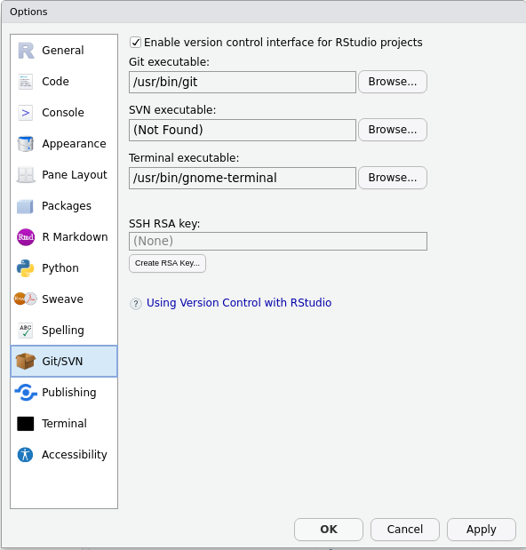
```

]


```{r echo=FALSE, results='asis'}
ref_pacotes_curso_r()
```


---

class: teoria

### Configurando com o SSH (Parte 2)


.pull-left[

** CRIANDO UMA CHAVE SSH**

- Não altere o primeiro campo, mas você pode adicionar uma senha caso queira. Porém você precisará informar essa senha todas as vezes que quiser fazer algumas ações como Pull ou Push. Clique em `Create`.

A sua senha será criada e aparecerá uma caixinha com ela. Pode clicar em `Close`.

Após fechar, veja se o campo `SSA RSA KEY` está preenchido.


]

.pull-right[


```{r echo=FALSE, fig.align='center', out.width="80%"}
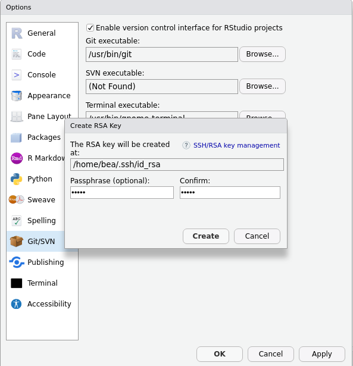
```

]

```{r echo=FALSE, results='asis'}
ref_pacotes_curso_r()
```


---


class: teoria

### Configurando com o SSH (Parte 3)


.pull-left[

**Verificando se o ssh-agent está funcionando**


- **Mac OS ou Linux** - no terminal, escreva:

```
eval "$(ssh-agent -s)"
```


- **Windows** - no Git Bash shell, escreva:

```
eval $(ssh-agent -s)
```


]

.pull-right[


<br><br><br><br>
A resposta esperada, nessa etapa, é algo como:
```
Agent pid 14198
```

]


```{r echo=FALSE, results='asis'}
ref_pacotes_curso_r()
```


---


class: teoria

### Configurando com o SSH (Parte 4)


.pull-left[

**Adicionando a chave SSH no ssh-agent**

- Se você definiu uma senha ao criar a chave SSH, ela será solicitada nessa etapa.


- **Linux** - no terminal, escreva:

```
ssh-add ~/.ssh/id_rsa
```


- **Mac OS** - no terminal, escreva:

```
ssh-add -K ~/.ssh/id_rsa
```


- **Windows** - no Git Bash shell, escreva:

```
ssh-add ~/.ssh/id_rsa
```

]

.pull-right[

A resposta esperada, nessa etapa, é algo como:
```
Identity added: /home/bea/.ssh/id_rsa
```
```{r echo=FALSE, fig.align='center', out.width="80%"}
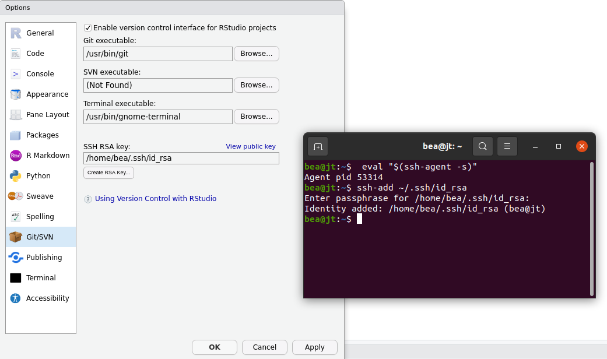
```

]


```{r echo=FALSE, results='asis'}
ref_pacotes_curso_r()
```


---


class: teoria

### Configurando com o SSH (Parte 5)


**Adicionando a chave pública no GitHub**

- No GitHub, vá em `Settings` -> `SSH and GPG keys` -> `New SSH key` (ou clique aqui: https://github.com/settings/ssh/new )  


- No RStudio, clique em `Tools` -> `Global Options...` -> `Git/SVN`. No campo `SSH RSA Key`, clique em `View Public Key`.

- Uma janela vai abrir com a chave pública e você deve copiar o conteúdo todo.

- No campo `Title`, escreva algo que ajude você a lembrar em qual computador essa chave está sendo usada. No campo `Key`, cole todo o conteúdo copiado na etapa anterior. Clique em `Add SSH key`.


```{r echo=FALSE, results='asis'}
ref_pacotes_curso_r()
```


---


class: teoria

### Configurando com o SSH (Parte 6) - Dicas

- Confira se está funcionando executando o seguinte código na aba Terminal, no RStudio: 
```
ssh -T git@github.com
```

- Ao clonar um projeto, é importante utilizar o protocolo que foi configurado. O protocolo padrão utilizado pelo usethis é o `https`. Para alterar para o `SSH` , altere no `.Rprofile` o protocolo padrão a ser utilizado: 

  - Abrir o arquivo o `.Rprofile`: 
  
```
usethis::edit_r_profile()
```

  - Adicione a seguinte linha neste arquivo:
  
```
options(usethis.protocol = "ssh")
```

  - Salve o arquivo e reinicie o RStudio.

```{r echo=FALSE, results='asis'}
ref_pacotes_curso_r()
```


---

class: teoria

### Versione com o Git e o GitHub

```r
usethis::use_git()
```

- Rodando o comando acima na pasta do projeto (a nova aba do RStudio que
apareceu) você adiciona controle de versão.

- Você receberá algumas instruções para seguir, mas está tudo certo.

```r
usethis::use_github()
```

- O comando acima sincroniza a pasta com o GitHub.

- Mais uma vez, você receberá algumas instruções, mas lembre-se  de alterar para o protocolo `SSH` caso tenha feito a configuração usando esse protocolo. Para isso, use o argumento `protocol = ssh`.

```{r echo=FALSE, results='asis'}
ref_pacotes_curso_r()
```

---
class: exercicios

### Colocar em prática: Para casa  

1) Configure o Git e GitHub no RStudio. Caso você utilize Linux, lembre-se de fazer a configuração com o protocolo `SSH`.

Caso não funcione, não esqueça de informar o resultado da função `usethis::git_sitrep()`.


---

class: livecoding

### Resumo

- Comece praticando nos seus projetos. Quando estiver confortável, pode começar a contribuir com projetos de outras pessoas! :)

- Fluxo de trabalho: 

1. Repositório: Criar projeto/pacote

2. Adicionar Git

3. Adicionar GitHub

4. Commit: Edite e "Commite" as mudanças no código

5. Push: Suba os commits para o GitHub

6. Pull (extra): Baixe o estado atual do projeto


---
class: teoria

### Interface Gráfica RStudio

- O RStudio oferece um cliente Git **simples**, na aba "Git" (em inglês, é chamado de Git Pane).

- Esse painel somente aparecerá em projetos que estejam versionados com Git.

```{r, out.width="60%"}
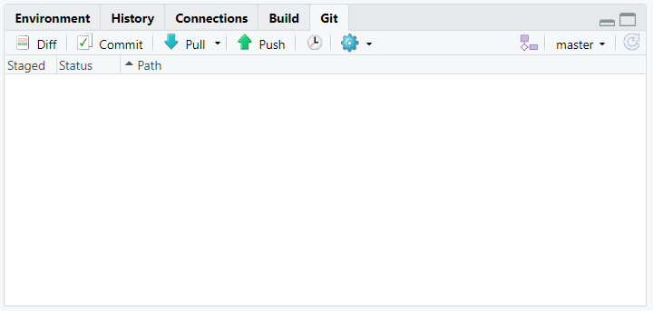
```


---
class: teoria

### Git pane - Staged  `r emo::ji("white_check_mark")`

```{r, out.width="70%"}
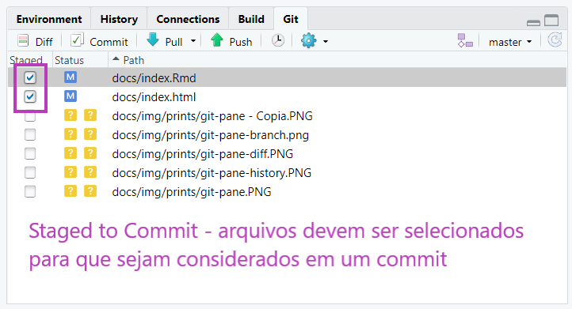
```

---
class: teoria

### Git pane - Commit

```{r, out.width="70%"}
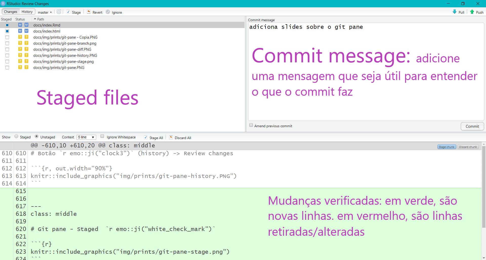
```

---
class: teoria

### Git pane - Commit

```{r, out.width="70%"}
knitr::include_graphics("img/prints/git_commit.PNG")
```


---
class: teoria

### Botão Diff -> Review changes

```{r, out.width="70%"}
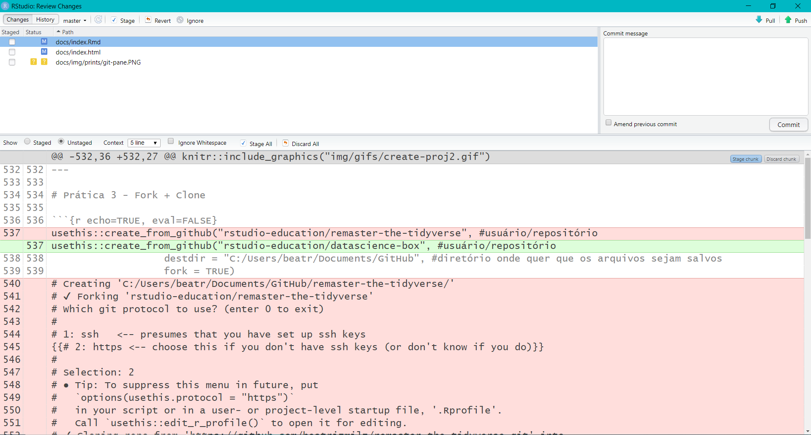
```

---
class: teoria

### Botão `r emo::ji("clock3")` (history) -> Review changes

```{r, out.width="70%"}
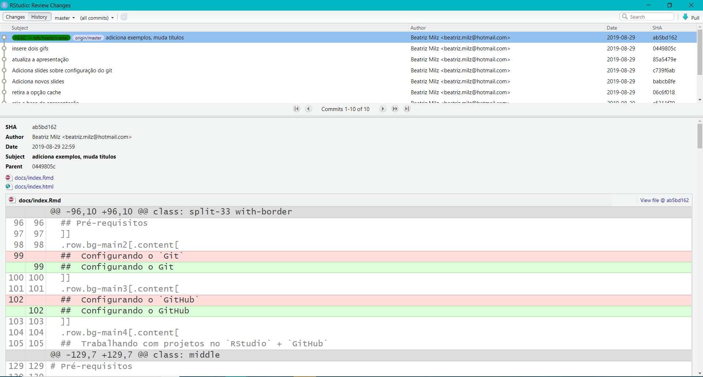
```


---
class: teoria

### Trabalhando com projetos no RStudio + GitHub

- Três formas para começar:

  - Clonando um repositório que existe no GitHub usando a interface do RStudio.

  - Criando um projeto no R, iniciando o versionamento e criando um repositório no GitHub usando funções do `usethis`.
  
  -  A partir de um repositório existente no GitHub, fazer um fork e clonar usando funções do `usethis`.
  


---
class: teoria

### Método 1

**Clonando um repositório que existe no GitHub usando a interface do RStudio**

- [Crie um repositório no GitHub](https://github.com/new), ou abra a página de um repositório já existente. 

.pull-left[
- Criando um repositório no GitHub:

```{r out.width="60%"}
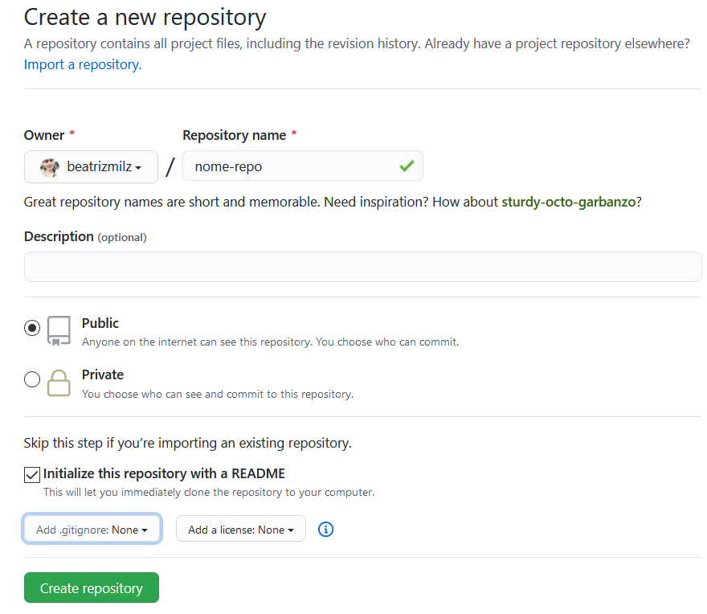
```

]

.pull-right[

Se o repositório não for "seu", faça um fork primeiro, e clone o seu fork. 

```{r out.width="100%"}
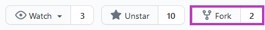
```

]


---
class: teoria


- No RStudio, crie um novo projeto: File > New Project 
.pull-left[
- Na aba "Create Project", selecione a opção **Version Control**.

```{r out.width="100%"}
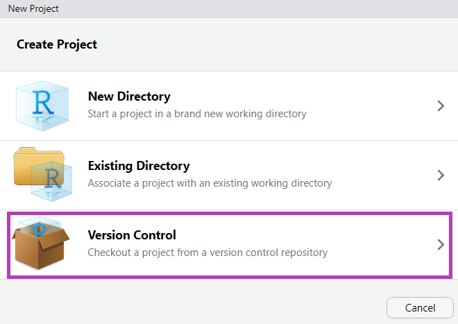
```
]

.pull-right[

- Na aba "Create Project from Version Control", selecione a opção **Git**.

```{r out.width="100%"}
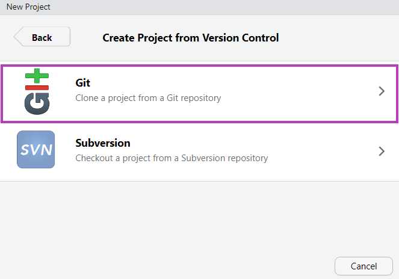
```
]


---
class: teoria


- Na aba "Clone Git Repository":
  - **Repository URL**: Cole o link para o repositório
  - **Project directory name**: Após inserir o repository URL, esse campo será preenchido automaticamente.
  - **Create project as subdirectory of**: Selecione o diretório onde você deseja manter sua cópia local do repositório.
  
```{r out.width="30%"}
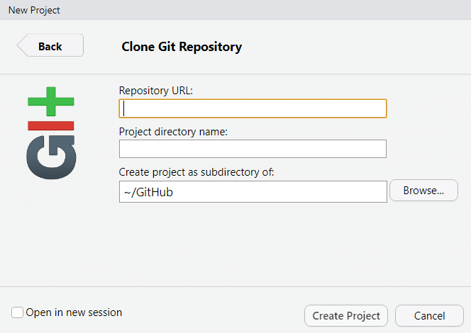
```

- O **RStudio** irá fazer o clone do repositório, e abrirá um RProj para ele (caso não exista um ainda, será criado).

---
class: teoria


### Método 2

- **Criando um repositório novo, diretamente do RStudio**

- Vamos usar a função `usethis::create_project()` 
  - Cria um projeto `.Rproj`
  - Argumento importante: `path = ` 	É o caminho para o diretório (pasta) onde queremos criar o projeto. Se o diretório já existe, é utilizado. Se não existe, é criado. 
  - Cuidado com o nome do projeto, pois será o mesmo nome que será utilizado no repositório. Você não deve usar o nome de algum repositório já existente no seu GitHub.

---
class: teoria


### Criando um projeto

- No meu caso, tenho o hábito de deixar todos os repositórios do GitHub, na pasta `GitHub/`. No exemplo abaixo, dentro da pasta GitHub, criei o projeto chamado Teste. Esse será o nome da pasta criada e posteriormente do repositório no GitHub.

```{r echo=TRUE, eval=FALSE}
usethis::create_project("~/GitHub/Teste") 
# ✔ Creating 'GitHub/Teste/'
# ✔ Setting active project to 'C:/Users/beatr/Documents/GitHub/Teste'
# ✔ Creating 'R/'
# ✔ Writing 'Teste.Rproj'
# ✔ Adding '.Rproj.user' to '.gitignore'
# ✔ Opening 'GitHub/Teste/' in new RStudio session
# ✔ Setting active project to '<no active project>'
```
- O RStudio abrirá outra janela, com o novo projeto criado.

---
class: teoria


### Novo projeto criado! 

- Projeto `r emo::ji("heavy_check_mark")`

- Git `r emo::ji("x")`

- GitHub `r emo::ji("x")`

```{r out.width="50%"}
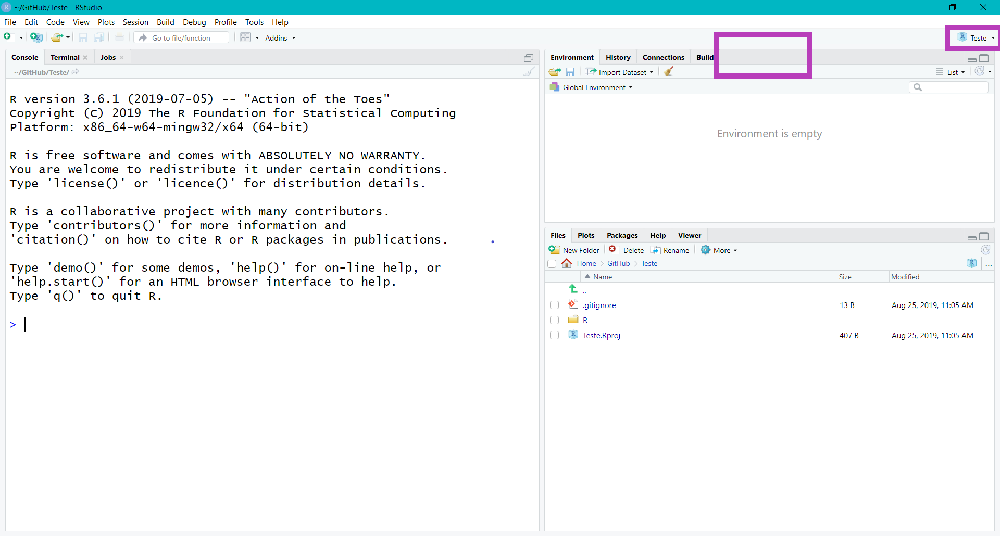
```

---
class: teoria


```{r echo=TRUE, eval=FALSE}
usethis::use_git()
# ✔ Setting active project to 'C:/Users/beatr/Documents/GitHub/Teste'
# ✔ Initialising Git repo
# ✔ Adding '.Rhistory', '.RData' to '.gitignore'
# There are 2 uncommitted files:
# * '.gitignore'
# * 'Teste.Rproj'
# Is it ok to commit them?
# 
{{# 1: Absolutely  }}
# 2: Negative
# 3: No
# 
# Selection: 1
# ✔ Adding files
# ✔ Commit with message 'Initial commit'
# ● A restart of RStudio is required to activate the Git pane
# Restart now?
# 
# 1: No way
{{# 2: For sure}}
# 3: Negative
# 
# Selection: 2
```

- O RStudio irá reiniciar para que apareça o painel do Git

---
class: teoria


### Usando Git

- Projeto `r emo::ji("heavy_check_mark")`

- Git `r emo::ji("heavy_check_mark")`

- GitHub `r emo::ji("x")`

```{r out.width="50%"}
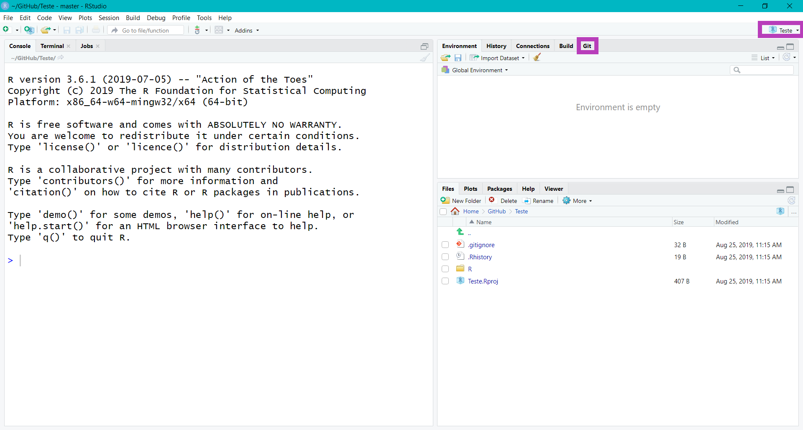
```


---
class: teoria


```{r echo=TRUE, eval=FALSE}
usethis::use_github()
# ✔ Setting active project to 'C:/Users/beatr/Documents/GitHub/Teste'
# ✔ Checking that current branch is 'master'
# Which git protocol to use? (enter 0 to exit) 
# 
# 1: ssh   <-- presumes that you have set up ssh keys
{{# 2: https <-- choose this if you don't have ssh keys (or don't know if you do)}}
# 
# Selection: 2
# ● Tip: To suppress this menu in future, put
#   `options(usethis.protocol = "https")`
#   in your script or in a user- or project-level startup file, '.Rprofile'.
#   Call `usethis::edit_r_profile()` to open it for editing.
# ● Check title and description
#   Name:        Teste
#   Description: 
# Are title and description ok?
# 
# 1: No way
{{# 2: Definitely}}
# 3: Nope
# 
# Selection: 2
# ✔ Creating GitHub repository
# ✔ Setting remote 'origin' to 'https://github.com/beatrizmilz/Teste.git'
# ✔ Pushing 'master' branch to GitHub and setting remote tracking branch
# ✔ Opening URL 'https://github.com/beatrizmilz/Teste'
```

---
class: teoria


### Repositório criado!

- Projeto `r emo::ji("heavy_check_mark")`

- Git `r emo::ji("heavy_check_mark")`

- GitHub `r emo::ji("heavy_check_mark")`

```{r out.width="50%"}
knitr::include_graphics("img/prints/criou-repositorio-github.PNG")
```

---
class: teoria


### Função para criar um arquivo `README.md`

```{r, echo=TRUE, eval=FALSE}
usethis::use_readme_md()
```
- O arquivo será criado e aberto, para ser editado e salvo.

```{r, out.width="20%"}
knitr::include_graphics("https://media2.giphy.com/media/1iu8uG2cjYFZS6wTxv/giphy-downsized.gif")
```


---
class: teoria


### Método 3

- **A partir de um repositório existente, fazer um fork e clonar diretamente do RStudio**

- Para isso, usaremos a função `usethis::create_from_github()`.

- Argumentos importantes:
  - `repo_spec = ` repositório que quer trabalhar. Deve estar no formato: "usuario_github/repositorio". Veja o exemplo abaixo.
  - `destdir =` diretório onde quer que os arquivos sejam salvos
  - `fork =` se igual a TRUE, irá fazer o fork do repositório. Só funcionará se o token do GitHub foi configurado corretamente.

---
class: teoria


### Exemplo do uso da função `create_from_github()`

- Exemplo: fork e clone do projeto [Lista de meetups R-Ladies no Brasil](https://github.com/R-Ladies-Sao-Paulo/RLadies-Brasil):


```{r echo=TRUE, eval=FALSE}
usethis::create_from_github("R-Ladies-Sao-Paulo/RLadies-Brasil",
                   destdir = "C:/Users/beatr/Documents/GitHub", 
                   fork = TRUE)
# ✔ Creating 'C:/Users/beatr/Documents/GitHub/datascience-box/'
# ✔ Forking 'R-Ladies-Sao-Paulo/RLadies-Brasil'
# ✔ Cloning repo from 'https://github.com/beatrizmilz/RLadies-Brasil.git' into 'C:/Users/beatr/Documents/GitHub/RLadies-Brasil'
# ✔ Setting active project to 'C:/Users/beatr/Documents/GitHub/RLadies-Brasil'
# ✔ Adding 'upstream' remote: 'https://github.com/R-Ladies-Sao-Paulo/RLadies-Brasil.git'
# ✔ Pulling changes from GitHub source repo 'upstream/master'
# ✔ Setting remote tracking branch for local 'master' branch to 'upstream/master'
# ✔ Opening 'C:/Users/beatr/Documents/GitHub/RLadies-Brasil/' in new RStudio session
# ✔ Setting active project to 'C:/Users/beatr/Documents/GitHub/RLadies-Git-RStudio-2019'
```

---
class: teoria

### Cuidados

- Cuidado para não enviar arquivos com senhas ou dados sigilos. Adicione no arquivo `.gitignore` o caminho para os arquivos que você não quer versionar. Caso não encontre esse arquivo, abra-o utilizando a função `usethis::edit_git_ignore()`:

```r
usethis::edit_git_ignore(scope = "project")
```

- Se uma base de dados tem mais do que 50Mb de tamanho, ela não deveria estar no seu repositório.

- Nem sempre o comando Pull dá certo. Às vezes, você e a colega de trabalho fizeram mudanças no mesmo arquivo e, quando vão juntar, ocorre um conflito.

```{r echo=FALSE, results='asis'}
ref_pacotes_curso_r()
```

---

class: livecoding

### Fluxo de trabalho

1. Repositório: Criar projeto/pacote

2. Adicionar Git

3. Adicionar GitHub

4. Commit: Edite e "Commite" as mudanças no código

5. Push: Suba os commits para o GitHub

6. Pull (extra): Baixe o estado atual do projeto

---
name: githubpages
class: livecoding

### Disponibilizar arquivos na internet

- Como disponibilizar um documento em RMarkdown na internet, usando o GitHub?

- O arquivo `.html` da página principal deverá se chamar `index.html`. 

- Configure o repositório para ativar a GitHub Pages: 
  - Abra a página do seu repositório
  - Clique em Settings
  - No menu lateral, clique em Pages
  - Em source:
      - Altere na opção `Branch` para main ou master (dependendo do caso do repositório). Não pode ser a opção `none`. 
      - Selecione `root/` ou `docs/`, dependendo de onde os arquivos estão salvos.
      - Clique em `Save`.
    
O GitHub oferecerá um link para acessar a página. 

---
class: revisao

### Revisão - Git e GitHub


  - Com o controle de versão de arquivos, podemos guardar o histórico de alterações de todos os arquivos dentro de uma pasta (que chamamos de repositório).
  
  - Git é um sistema de versionamento. É um software que instalamos no computador.
  
  - GitHub é um site onde podemos armazenar repositórios versionados com Git. É um site que acessamos na internet..
  
  - Podemos usar o Git e GitHub diretamente via RStudio. Essa configuração pode ser um pouco trabalhosa, mas vale a pena.
  
  - Podemos disponibilizar documentos feitos com RMarkdown na internet, usando o GitHub. Esse slide é um exemplo :)


---
name: exemplo-pratico
class: middle, center, inverse


## Exemplo prático


---
class: livecoding


### Exemplo prático


Etapas:

  - Criar um projeto no RStudio

  - Iniciar o controle de versão com Git

  - Iniciar um repositório no GitHub

  - Criar um documento RMarkdown - O tipo de documento será escolhido previamente pela turma! 

  - Adicionar conteúdo no `.Rmd`: parâmetros, código e resultados, código em linha, tabela, gráfico, imagens, etc.

  - Disponibilizar o documento na internet com GitHub Pages ou Netlify

  - Fazer alterações no `.Rmd` e atualizar a versão que está online

---

### Referências

- [Slide](https://curso-r.github.io/main-pacotes/slides/index.html) do curso de [Pacotes](https://curso-r.com/cursos/pacotes/), da [Curso-R](https://curso-r.com/).


- [Livro Zen do R](https://curso-r.github.io/zen-do-r/)

- [Livro Ciência de Dados em R](https://livro.curso-r.com/)
  
- [Happy Git and GitHub for the useR - Jenny Bryan](https://happygitwithr.com/)


- Documentação do pacote [usethis](https://usethis.r-lib.org/reference/create_package.html)

- Mais referências disponíveis aqui: https://beatrizmilz.github.io/2022-curso-de-verao-ime-usp-relatorios/bibliografia.html


---
class: center

## Agradecemos a atenção!


Slides criados usando os pacotes em R  📦 :

[**xaringan**](https://github.com/yihui/xaringan)<br>
[gadenbuie/xaringanthemer](https://github.com/gadenbuie/xaringanthemer)

O chakra vem da biblioteca javascript [remark.js](https://remarkjs.com), e os pacotes  [**knitr**](http://yihui.name/knitr), e [R Markdown](https://rmarkdown.rstudio.com).


<!-- inicio font awesome -->
<script src="https://kit.fontawesome.com/1f72d6921a.js" crossorigin="anonymous"></script>

<!-- final font awesome -->
