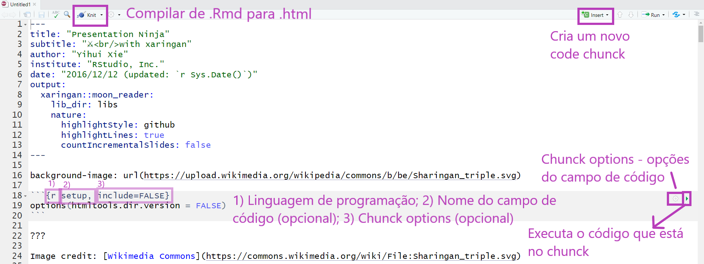

---


### Adicionando conteúdo no arquivo .Rmd


#### Chunks de Código R

Os chunks são campos onde podemos inserir código de R (ou Python, SQL,  Bash...) em um arquivo RMarkdown. Existe um atalho do teclado para criar chunks no RStudio:  `Ctrl + ALt + I`. Também é possível criar um chunk clicando no seguinte botão do RStudio:


```{r echo=FALSE, out.width="90%"}
knitr::include_graphics("https://beatrizmilz.github.io/slidesR/img/rmarkdown/create-chunck.png")
```

---

class:

## Exemplo:

```{r echo=TRUE}
summary(mtcars)
```

---
class:

## Exemplo:

.left-code[
```{r plot-exemplo-ggplot2, echo=TRUE, fig.show="hide", out.width="95%", echo=TRUE}
library(ggplot2)
ggplot(mtcars) +
  aes(x = hp,
      y = mpg,
      colour = cyl) +
  geom_point(size = 2L)
```
]

.right-plot[
`)
]


---
class:

## Opções de Chunk

- Há uma variedade de opções de chunk que podem afetar como os chunks de código são compilados. Exemplos: 

- `echo=FALSE`- evita que o próprio código apareça

- `eval=FALSE` - mostra o código, mas ele não é executado

- `warning=FALSE` e `message=FALSE` - oculta mensagens de avisos produzidas

- `out.width` - controla o a largura das figuras, gráficos, tabelas geradas (Ex: out.width = "100%")

- Ex de configuração do chunk: `{r, warning=FALSE, message=FALSE}`


---
class:

## Códigos em R - Opções de chunk

.pull-left[
#### Código + Resultado
- `echo=TRUE`
```{r echo=TRUE}
nrow(mtcars)
```
]

.pull-right[

#### Apenas código
- `echo=TRUE, eval=FALSE`
```{r echo=TRUE, eval=FALSE}
nrow(mtcars)
```

#### Apenas resultado
- `echo=FALSE`
```{r echo=FALSE}
nrow(mtcars)
```

]

---
class: 

## Dicas - RStudio


```{r echo=FALSE, out.width="100%"}

```


---


## Código inline

A base mtcars possui `r nrow(mtcars)` carros.

**Código Markdown:**

```{r,  eval=F, echo=T}
A base mtcars possui `r nrow(mtcars)` carros.
```


---

## Opções globais de Chunk

As opções globais de chunk são opções de chunk que são válidas para o documento inteiro. Algumas opções são úteis, como `fig.align = "center"`.
Para configurar as opções globais de chunk, modifique o código abaixo e insira após o código `YAML` (retire os `#` no início de cada linha):

- Ex:
  - Configurações do chunk:
`{r setup, include=FALSE}`
  - Conteúdo do chunk:
`knitr::opts_chunk$set(...)`


---


## Adicionando imagens usando o knitr

Função: `knitr::include_graphics()`

Exemplo:
```{r  out.width = "30%"}
knitr::include_graphics("https://www.r-project.org/Rlogo.png")
```

---
class:

## Adicionando imagens usando knitr

### Opções de Chunk 

- `out.width = "30%"` - tamanho da imagem


```{r echo=FALSE, out.width = "30%"}
knitr::include_graphics("https://www.r-project.org/Rlogo.png")
```

[Opções do KnitR](https://yihui.name/knitr/options/#chunk-options)

---
class:

## Adicionando imagens usando knitr

### Opções de Chunk 

- **Alinhamento da figura**
- `fig.align = 'center', 'default', **'left'**,'right'` 

```{r echo=FALSE,  out.width="10%", fig.align='left'} 
knitr::include_graphics("https://www.r-project.org/Rlogo.png")
```

- `fig.align = 'center', 'default', 'left', **'right' **`

```{r echo=FALSE,  out.width="10%", fig.align='right'}
knitr::include_graphics("https://www.r-project.org/Rlogo.png")
```

---


## Adicionando imagens usando knitr

### Opções de Chunk 

- Legenda de figura 

- `fig.cap="Logo R"`


```{r echo=FALSE,  out.width="30%", fig.cap="R Logo", fig.align='center'}
knitr::include_graphics("https://www.r-project.org/Rlogo.png")
```


---

### Tabelas em Markdown

.pull-left[

- **Resultado:**


|Petal.Length|Petal.Width|Species|
|-----------:|----------:|:------|
|        1.4|       0.2|setosa  |
|        1.4|       0.2|setosa  |
|        1.3|       0.2|setosa  |
|        1.5|       0.2|setosa  |
|        1.4|       0.2|setosa  |
|        1.7|       0.4|setosa  |
]

.pull-right[
- **Código Markdown**:


```{r  eval=F, echo=T}
| Petal.Length| Petal.Width|Species |
|------------:|-----------:|:-------|
|          1.4|         0.2|setosa  |
|          1.4|         0.2|setosa  |
|          1.3|         0.2|setosa  |
|          1.5|         0.2|setosa  |
|          1.4|         0.2|setosa  |
|          1.7|         0.4|setosa  |
```

]

---

### Tabelas com R

```{r echo=TRUE}
knitr::kable(x = head(iris), format = "html")
```

- Outra opção:  `DT::datatable(iris)`  


---

## ERRO!

- Boa prática: compilar com frequência. 

- É bem comum dar erro ao compilar o arquivo pois **qualquer** código errado causa isso. Algumas coisas pra se observar:

  - **YAML header** - se algo estiver errado, vai dar erro ao compilar. 
Muito cuidado com a identação!

  - **Código nos chunks** - teste o _Run All Chunks_ e veja se aparece erro em algum chunk específico.
Se descobrir, tente verificar o que há de errado no código (pode ser a falta de um parênteses, vírgula, entre outros).

  - Todos os objetos e pacotes usados no seu script precisam estar disponíveis no seu `.Rmd`. Verifique isso :)

```{r echo=FALSE, out.width="10%"}
knitr::include_graphics("https://media.giphy.com/media/j9GASQ5ocrIRicnmyq/giphy.gif")
```


---

## Coisas legais com R Markdown

- Gerar um PDF! 

- Visualizar uma prévia enquanto estamos escrevendo: `xaringan::inf_mr()` 
  


---
#### Templates de R Markdown
-  Pacotes também oferecem templates (`File > New File > R Markdown > From template`).

---
name: git-e-github
class: middle, center, inverse


## Git e GitHub


---

### O que é Git?

- Git é um **sistema de versionamento**, criado por Linus Torvalds, autor do Linux.

- É capaz de guardar o histórico de alterações de todos os arquivos dentro de uma pasta, que chamamos de repositório.

- Funciona como o "*Track changes*" do word, mas muito melhor.

- Torna-se importante à medida que seu trabalho é __colaborativo__.

- Git é um software que você instala no computador.

  

```{r out.width="30%"}
knitr::include_graphics("https://git-scm.com/images/logo@2x.png")
```

> <i class="far fa-flag"></i> [Slide](https://curso-r.github.io/main-pacotes/slides/index.html) do curso de [Pacotes](https://curso-r.com/cursos/pacotes/), da [Curso-R](https://curso-r.com/).


---

### O que é GitHub?


- GitHub é um site onde você coloca e compartilha repositórios Git.

- Utilizado por milhões de pessoas em projetos de código aberto ou fechado.

- Útil para colaborar com outros programadores em projetos de ciência de dados.

- Existem alternativas, como [GitLab](https://about.gitlab.com/) e [BitBucket](https://bitbucket.org/product).

- GitHub é um site que você acessa na internet.

```{r out.width="30%"}
knitr::include_graphics("img/github-logo.png")
```

<br>

> <i class="far fa-flag"></i> [Slide](https://curso-r.github.io/main-pacotes/slides/index.html) do curso de [Pacotes](https://curso-r.com/cursos/pacotes/), da [Curso-R](https://curso-r.com/).


